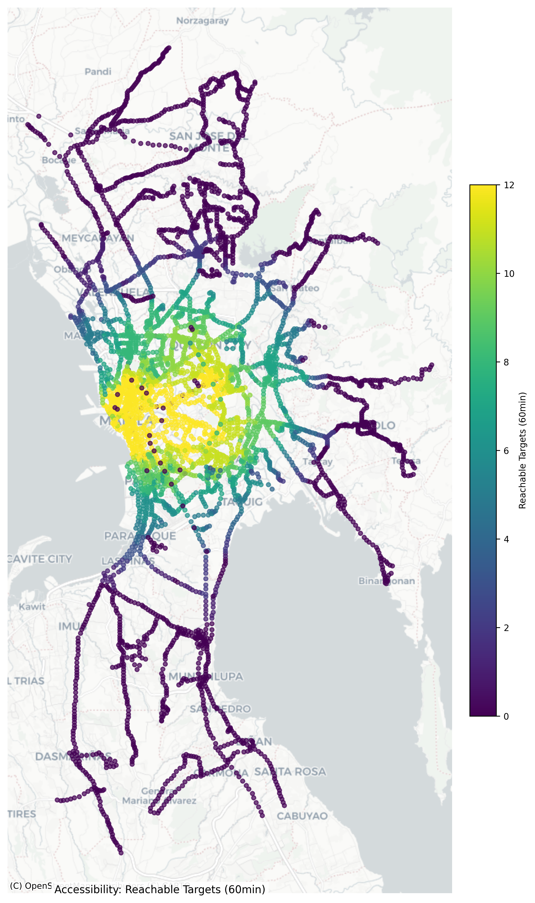

# Transportation Analysis Toolkit

This repository contains a suite of Python scripts for analyzing transportation systems using both GTFS data (for public transport networks) and video footage (for traffic counting).

**Two main functionalities are included:**

1.  **GTFS Network Analysis Workflow:** Analyzes public transport network structure, performance, and resilience based on GTFS data. It generates metrics, identifies potential issues, provides recommendations, and visualizes results (`network_analysis.py`, `recommendations.py`, `spatial_analysis.py`).
2.  **Video Traffic Counting Workflow:** Utilizes object detection (via Roboflow) and tracking (via Supervision) to count vehicles crossing a virtual line in video footage, aggregating counts by class over time intervals (`computer_vision.py`).

---

## Features

### GTFS Network Analysis Features

* **Data Loading:** Handles standard GTFS files and optional supplementary stop data.
* **Graph Construction:** Builds a `networkx` directed graph weighted by scheduled travel time.
* **Connectivity:** Calculates Beta, Gamma, Density indices.
* **Centrality:** Calculates Degree, Closeness (on largest SCC), Betweenness centrality.
* **Accessibility:** Measures reachability to defined target stops within time limits.
* **Route Overlap:** Identifies routes sharing a high percentage of stops.
* **Route Circuity:** Compares actual route time vs. shortest path time.
* **Transfer Analysis:** Estimates transfers for sample OD pairs.
* **Resilience:** Simulates node removal (by degree/betweenness) and measures impact on SCC, ASPL, and Accessibility.
* **Comparison (Optional):** Compares graph PT time vs. Google Maps Driving & Transit times.
* **Recommendations:** Generates CSVs suggesting routes for rationalization, areas with poor accessibility, inefficient routes, and critical hubs.
* **Visualization (Optional):** Creates histograms, bar plots, and spatial maps (requires optional libraries) for key metrics.

### Video Traffic Counting Features

* **Roboflow Integration:** Connects to Roboflow API to load a specified object detection model.
* **Video Processing:** Handles multiple video files from an input folder.
* **Object Detection & Tracking:** Detects objects using the Roboflow model and tracks them using Supervision's ByteTrack.
* **Class Filtering:** Processes only user-specified object classes (must match model classes).
* **Line Crossing Counts:** Counts tracked objects crossing a predefined virtual line (in/out).
* **Aggregation:** Summarizes counts per class over specified time intervals.
* **Output:** Saves aggregated counts to structured CSV files.
* **Visualization (Optional):** Displays video frames with detections, tracking IDs, and the counting line during processing.

---

## Prerequisites

* **Python:** Version 3.8 or higher recommended.
* **Libraries:** All required libraries for both workflows are listed in `requirements.txt`. Install using `pip install -r requirements.txt`.

---

## Setup

1.  **Clone/Download:** Get all script files (`network_analysis.py`, `recommendations.py`, `spatial_analysis.py`, `roboflow_analysis.py`) and the `requirements.txt` file.
2.  **Install Python:** Ensure you have a compatible Python version installed.
3.  **Install Dependencies:**
    ```bash
    pip install -r requirements.txt
    ```
     **Note on GeoPandas:** If installing `geopandas` via pip fails (common due to C dependencies), using `conda` is recommended: `conda install -c conda-forge geopandas contextily`. You might need to manage conda and pip environments carefully.
    
5.  **API Keys:**
* **Roboflow API Key (Required for Video Analysis):**
    * Obtain your key from your Roboflow account settings.
    * **Set as Environment Variable (Highly Recommended):**
        ```bash
        export ROBOFLOW_API_KEY="YOUR_ACTUAL_ROBOFLOW_KEY"
        ```
    * Or, replace the placeholder in `roboflow_analysis.py`
      
* **Google API Key (Optional for GTFS Comparison):**
    * Obtain a key from Google Cloud Platform with the **Directions API** enabled.
    * **Set as Environment Variable (Recommended):**
        ```bash
        export GOOGLE_API_KEY="YOUR_ACTUAL_GOOGLE_API_KEY"
        ```
    * Or, replace the placeholder in `network_analysis.py` and `recommendations.py`. Set to `None` to disable.
6.  **Input Data & Folders:** Create the following folder structure and place your data accordingly:
    ```
    your_project_directory/
    │
    ├── network_analysis.py
    ├── recommendations.py
    ├── spatial_analysis.py
    ├── computer_vision.py  
    ├── requirements.txt
    │
    ├── gtfs/                 # For GTFS workflow
    │   ├── stops.txt           # Mandatory
    │   ├── routes.txt          # Mandatory
    │   ├── trips.txt           # Mandatory
    │   └── stop_times.txt      # Mandatory
    │   └── shapes.txt          # Mandatory
    │   └── agency.txt          
    │   └── calendar.txt
    │   └── feed_info.txt      
    │   └── frequencies.txt
    │   └── feed_info.txt  
    │
    ├── traffic_footage/      # For Video workflow, 1 sample video has been included
    │   └── video1.mp4
    │
    ├── edsa_stops.csv        # Optional supplementary stops for GTFS
    └── sample_output         # Sample output files (plots, csv files, etc.)
    ```
7.  **Check Configuration:** Review the "Configuration Constants" section at the top of each script. Adjust paths, API/model details, thresholds, `ALLOWED_CLASSES`, line coordinates, etc., as needed.
  * **Crucial for Video:** Ensure `ALLOWED_CLASSES` in `roboflow_analysis.py` exactly match the names in your Roboflow model version.

---

## Usage

### GTFS Network Analysis Workflow

Run the scripts **in this specific order**:

```bash
 1. Perform core network analysis 
python network_analysis.py

 2. Generate recommendations based on analysis results
python recommendations.py

 3. Visualize the analysis results (spatial plots require optional libraries, all included in the requirements.txt)
python spatial_analysis.py
```

### Vehicle Counter Workflow

```bash
 1. Perform traffic analysis on video files
python computer_vision.py
```

---
## Demo

More sample outputs available in the sample_output directory

### Network Analysis Plots


Sample plot generated with spatial_analysis.py

### Vehicle Counter Sample Frame


Frame Visualization of Object Detection


